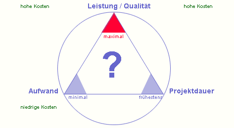

Projektparameter
================
Version 1.0, 02.01.2017
:toc:

= Projektparameter
== Teufelsquadrat / Teufelsviereck

* Kosten
* Entwicklungsdauer
* Qualität
* Funktionsumfang

Das Teufelsviereck verhaltet sich wie ein Spinnendiagramm.
Man kann die Fläche im Inneren des Viereckes umverteilen, jedoch keine Fläche hinzufügen oder entfernen.
Im Bild hat man beispielsweise auf Kosten der Qualität den Funktionsumfang erhöht und die Entwicklunsdauer verkürzt.

== Teufelsdreieck

Im Teufelsdreieck gibt es drei Parameter:

* Leistung / Qualität
* Aufwand / Kosten
* Projektdauer

Wie man in der Grafik sehen kann sind diese drei Parameter nicht gleichwertig. Die Leistung hat einen Maximalwert und kann nicht unendlich erhöht werden.
Der Aufwand und die Projektdauer haben einen Minimalwert und können nicht immer verringert werden.

Das Dreieck funktioniert folgendermassen. Möchte man einen Parameter erhöhen muss einer der anderen Parameter auch erhöht werden.
Möchte man nun beispielsweise die Qualität erhöhen müssen entweder die Kosten oder die Projektdauer erhöht werden.
Selbes gilt falls man die Projektdauer verkürzen möchte, wobei die Qualität sinkt.

= Überwachung der Projektparameter
== Kosten
Die Kosten entsprechen in unserem Projekt dem Aufwand multipliziert mit einem Stundensatz.
Zusätzliche Kosten werden manuell dokumentiert. 

== Funktionsumfang
Der Funktionsumfang ist in Form von Stories in unserem Scrum-Board dokumentiert.

== Qualität
Die Qualität wird durch die Anzahl gemeldeter Fehler und unsere Continous Integration gemessen. Die Continous Integration bewertet die technische Qualität und die Anzahl Fehler die fachliche Qualität.

== Aufwand
Der Aufwand wird duch die geschätzten Story-Points auf den Stories gemessen.